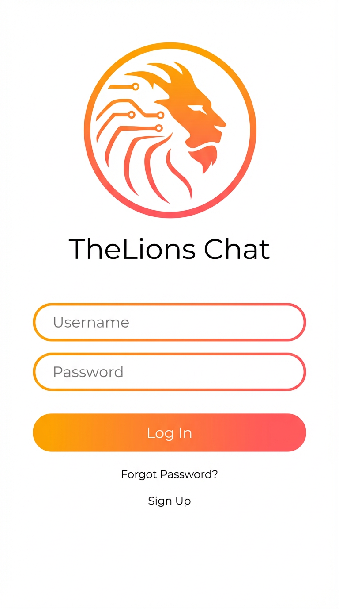
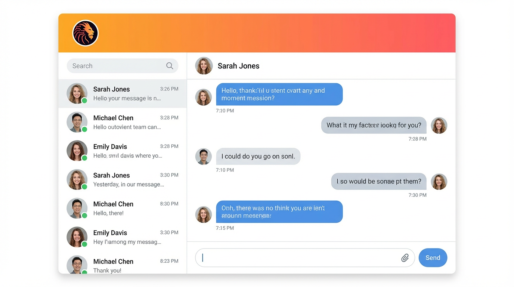

# 🦁 TheLions Server

**Plataforma Corporativa Integrada para Gestão Municipal**

[](https://opensource.org/licenses/MIT)
[](https://github.com/Thelionsinformatica/thelions-server/releases)
[](https://ubuntu.com/)
[](https://www.docker.com/)

---

## 📋 Sobre o Projeto

O **TheLions Server** é uma solução completa de infraestrutura de TI desenvolvida especificamente para órgãos públicos municipais brasileiros. Unifica serviços essenciais em um portal web moderno e totalmente personalizável, oferecido como serviço gerenciado (SaaS/PaaS).

### 🎯 Problema que Resolve

Prefeituras, câmaras municipais e autarquias enfrentam:
- ❌ Sistemas fragmentados e desconectados
- ❌ Altos custos com licenças proprietárias
- ❌ Falta de padronização visual
- ❌ Riscos de segurança e compliance
- ❌ Dependência de fornecedores internacionais

### ✅ Nossa Solução

- ✅ **Plataforma integrada** - Single Sign-On (SSO) para todos os serviços
- ✅ **100% Software Livre** - Economia de 60-80% em licenciamento
- ✅ **White-Label** - Interface com identidade visual do município
- ✅ **Soberania Digital** - Dados no próprio município (LGPD compliant)
- ✅ **Suporte Local** - Equipe técnica brasileira especializada

---

## 🚀 Instalação Rápida

### Pré-requisitos

- Ubuntu 24.04 LTS (servidor dedicado ou VM)
- 4 CPUs, 8 GB RAM, 100 GB disco
- Acesso root via SSH
- Conexão com internet

### Instalação com 1 Comando

```bash
curl -sSL https://raw.githubusercontent.com/Thelionsinformatica/thelions-server/main/install.sh | sudo bash
```

**Tempo estimado:** 15-20 minutos

---

## 📦 Módulos Integrados

### 1. 🔐 Active Directory (Samba 4)
- Gerenciamento centralizado de usuários e grupos
- Políticas de grupo (GPO)
- Autenticação única (SSO)
- Integração com Windows/Linux/Mac

### 2. 💬 Chat Corporativo (Openfire + Spark)
- Mensagens instantâneas estilo MSN
- Notificações sonoras quando usuários entram online
- Transferência de arquivos
- **Histórico completo de conversas** (auditoria)
- Salas de chat em grupo
- Integração com Active Directory

### 3. 📋 Helpdesk (GLPI)
- Gestão de chamados técnicos
- Inventário de hardware/software
- Base de conhecimento
- Relatórios e estatísticas
- Integração LDAP

### 4. 📁 File Server (Samba)
- Compartilhamento de arquivos
- Permissões baseadas em AD
- Acesso via rede (SMB/CIFS)
- Versionamento e backup

### 5. 🌐 Portal Web Unificado
- Interface moderna e responsiva
- Acesso centralizado a todos os serviços
- Customização white-label
- Dashboard de status

### 6. 🔒 VPN (WireGuard)
- Conexão segura entre unidades
- Replicação de Active Directory
- Baixa latência e alto desempenho

---

## 🎨 Personalização White-Label

Cada município tem sua própria identidade visual aplicada em **todos** os módulos:

- 🦁 Logotipo do município
- 🎨 Cores institucionais
- 🏛️ Brasão oficial
- 📝 Tipografia customizada

### Exemplo: Spark Customizado




---

## 🏗️ Arquitetura

```
┌─────────────────────────────────────────────────────────────┐
│           PORTAL WEB UNIFICADO (TheLions Server)            │
│           intranet.seumunicipio.gov.br                      │
├─────────────────────────────────────────────────────────────┤
│                                                               │
│  ┌────────────────┐  ┌────────────────┐  ┌────────────────┐│
│  │ Active         │  │ Chat           │  │ Helpdesk       ││
│  │ Directory      │  │ Corporativo    │  │ & Inventário   ││
│  │ (Samba 4 AD)   │  │ (Openfire +    │  │ (GLPI)         ││
│  │                │  │  Spark Custom) │  │                ││
│  └────────────────┘  └────────────────┘  └────────────────┘│
│                                                               │
│  ┌────────────────┐  ┌────────────────┐  ┌────────────────┐│
│  │ File Server    │  │ PostgreSQL     │  │ Nginx          ││
│  │ (Samba Shares) │  │ (Database)     │  │ (Proxy)        ││
│  │                │  │                │  │                ││
│  └────────────────┘  └────────────────┘  └────────────────┘│
│                                                               │
└─────────────────────────────────────────────────────────────┘
```

### Stack Tecnológica

| Camada | Tecnologias |
|--------|-------------|
| **Frontend** | React 18+, TypeScript, TailwindCSS |
| **Backend** | FastAPI (Python), PostgreSQL, Redis |
| **Infraestrutura** | Docker, Docker Compose, Nginx, Ubuntu 24.04 LTS |
| **Serviços Core** | Samba 4 AD, Openfire, GLPI, WireGuard |
| **Segurança** | HTTPS/TLS, JWT, LDAPS, UFW, Fail2ban |

---

## 📚 Documentação

- [📖 Guia de Instalação](docs/installation.md)
- [⚙️ Guia de Configuração](docs/configuration.md)
- [🔧 Resolução de Problemas](docs/troubleshooting.md)
- [🔌 API Reference](docs/api.md)
- [💬 Customização do Spark](docs/spark-customization.md)
- [📊 Auditoria de Conversas](docs/chat-audit.md)

---

## 🎯 Casos de Uso

### Prefeitura Municipal
- 150 funcionários
- 5 secretarias
- Chat corporativo integrado com AD
- Helpdesk centralizado
- Histórico de conversas para auditoria

### Câmara Municipal
- 30 usuários (vereadores + staff)
- Compartilhamento seguro de documentos
- Chat para comunicação rápida
- Inventário de equipamentos

### Autarquia/Fundação
- 80 servidores
- Múltiplas unidades conectadas via VPN
- Replicação de AD entre sites
- Base de conhecimento no GLPI

---

## 💰 Modelo de Negócio

### Investimento Inicial (Setup Fee)

| Porte | Usuários | Valor |
|-------|----------|-------|
| Pequeno I | Até 50 | R$ 5.000 |
| Pequeno II | 51-100 | R$ 8.000 |
| Médio | 101-250 | R$ 12.000 |
| Grande | 251-500 | R$ 18.000 |

### Mensalidade Recorrente

| Porte | Essencial | Avançado | Premium |
|-------|-----------|----------|---------|
| Pequeno I | R$ 1.500 | R$ 2.500 | R$ 4.000 |
| Pequeno II | R$ 2.500 | R$ 4.000 | R$ 6.500 |
| Médio | R$ 4.500 | R$ 7.000 | R$ 10.000 |
| Grande | R$ 7.500 | R$ 11.000 | R$ 15.000 |

**Diferença entre planos:**
- **Essencial:** Suporte 8x5
- **Avançado:** Suporte estendido, SLA reduzido
- **Premium:** Suporte 24/7, gerente de contas dedicado

---

## 🛠️ Desenvolvimento

### Estrutura do Repositório

```
thelions-server/
├── README.md                    # Este arquivo
├── install.sh                   # Script de instalação
├── docker-compose.yml           # Orquestração
├── configs/                     # Configurações
│   ├── nginx/
│   ├── samba/
│   ├── openfire/
│   ├── glpi/
│   └── wireguard/
├── scripts/                     # Scripts auxiliares
│   ├── setup-ad.sh
│   ├── setup-vpn.sh
│   ├── backup.sh
│   └── update.sh
├── portal/                      # Portal web
│   ├── index.html
│   ├── assets/
│   └── templates/
├── spark-custom/                # Spark customizado
│   ├── source/
│   ├── resources/
│   └── installer/
└── docs/                        # Documentação
```

### Contribuindo

1. Fork o projeto
2. Crie uma branch (`git checkout -b feature/nova-funcionalidade`)
3. Commit suas mudanças (`git commit -m 'Adiciona nova funcionalidade'`)
4. Push para a branch (`git push origin feature/nova-funcionalidade`)
5. Abra um Pull Request

---

## 📞 Suporte

### The Lions Informática

- 🌐 **Website:** [www.thelionsinformatica.com.br](http://www.thelionsinformatica.com.br)
- 📧 **Email:** contato@thelionsinformatica.com.br
- 📱 **WhatsApp:** (XX) XXXX-XXXX
- 🐙 **GitHub:** [@Thelionsinformatica](https://github.com/Thelionsinformatica)

### Comunidade

- 💬 **Discord:** [TheLions Community](https://discord.gg/thelions)
- 📖 **Wiki:** [wiki.thelionsinformatica.com.br](https://wiki.thelionsinformatica.com.br)
- 🐛 **Issues:** [GitHub Issues](https://github.com/Thelionsinformatica/thelions-server/issues)

---

## 📄 Licença

Este projeto está licenciado sob a **MIT License** - veja o arquivo [LICENSE](LICENSE) para detalhes.

---

## 🙏 Agradecimentos

- [Samba Team](https://www.samba.org/) - Active Directory
- [Ignite Realtime](https://www.igniterealtime.org/) - Openfire & Spark
- [GLPI Project](https://glpi-project.org/) - Helpdesk
- [WireGuard](https://www.wireguard.com/) - VPN
- Comunidade Open Source Brasileira 🇧🇷

---

## 🚀 Roadmap

### v1.0 (Atual)
- ✅ Instalação automatizada
- ✅ Samba 4 AD
- ✅ Openfire + Spark customizado
- ✅ GLPI
- ✅ Portal web básico
- ✅ WireGuard VPN

### v1.1 (Próximo)
- 🔄 Nextcloud (colaboração)
- 🔄 Webmail (Roundcube)
- 🔄 Dashboard administrativo
- 🔄 Backup automatizado

### v2.0 (Futuro)
- 📅 Integração com e-Cidade
- 📊 Business Intelligence
- 📱 App mobile nativo
- 🤖 Chatbot de suporte

---

<div align="center">

**Desenvolvido com ❤️ pela The Lions Informática**

🦁 **Transformando a TI Pública Brasileira** 🇧🇷

[⭐ Star no GitHub](https://github.com/Thelionsinformatica/thelions-server) | [🐛 Reportar Bug](https://github.com/Thelionsinformatica/thelions-server/issues) | [💡 Sugerir Feature](https://github.com/Thelionsinformatica/thelions-server/issues/new)

</div>
